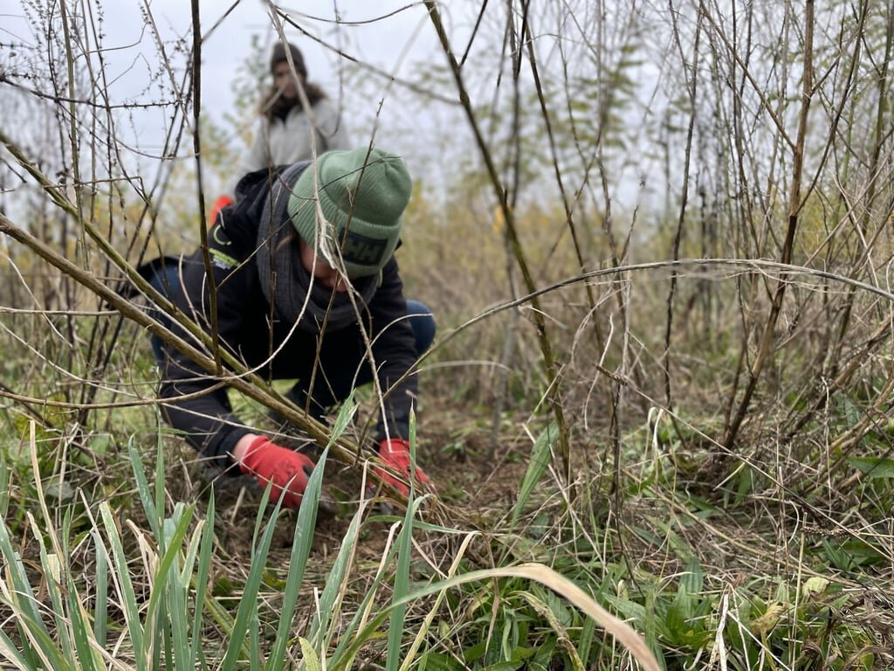

**La forêt nourricière est déjà bien établie, grâce à tous les arbres pionniers plantés au printemps 2023. On n’a qu’à se baisser un peu pour déjà se croire dans la forêt !**

Mais c’est une nouvelle étape très importante qui s’annonce : la plantation des arbres et arbustes de la forêt nourricière, la plupart offrant de futures récoltes comestibles. Ceux-ci vont être plantés au milieu des arbres pionniers qui auront pour rôle de les protéger des vents et du soleil pendant leurs premières années.

# Apprendre à planter

L’équipe de [Semisto](https://www.semisto.org) encadre les participants pour apprendre à planter les arbres en racine nue et les plantes en conteneur avec soin. C’est donc une super occasion de mettre les mains dans la terre et mieux connaitre les besoins des arbres et arbustes à la plantation.

# En pratique

📅 **Date et lieu** : dimanche 9 mars 2025 aux Jardins d’ici, de 10h à 15h

🎟 **Ouvert à toutes et tous - chantier gratuit**

🍲 **Soupe et pain offert à midi, en-cas festif à 15h**

📞 **Renseignements :** Michael Hulet au 0498/11.92.78 - [m.hulet@semisto.org](mailto:m.hulet@semisto.org)
