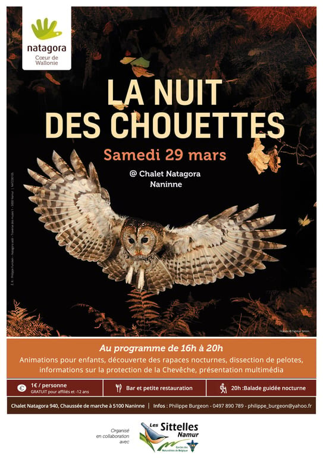

**Natagora Coeur de Wallonie vous convient à la Nuit des chouettes ce samedi 29 mars.**

# Au programme de 16h à 20h

- Animation pour enfants
- Découverte des rapaces nocturnes
- Dissection de pelotes
- Informations sur la protection de la chevêche
- Présentation multimédia

**Sans oublier…**

- Un bar et petite restauration !

**Pour un tout petit coût soutien de 1€/personne, gratuit pour les affiliés et moins de 12 ans.**

# Balade guidée nocturne

À 20h, partez en balade nocturne, en collaboration avec [Les Sittelles Namur](https://cnb-namur.sitew.be/) - Cercles des Naturalistes de Belgique.

# Au chalet Natagora

Ça se passe ce 29 mars au chalet Natagora, aux Jardins d’ici.

# Pour plus d’infos

*Cet événement est organisé par Natagora Coeur de Wallonie en collaboration avec Les Sittelles Namur.*

Contactez Philippe Burgeon au 0497/890.789 ou à [philippe\_burgeon@yahoo.fr](mailto:philippe_burgeon@yahoo.fr).
