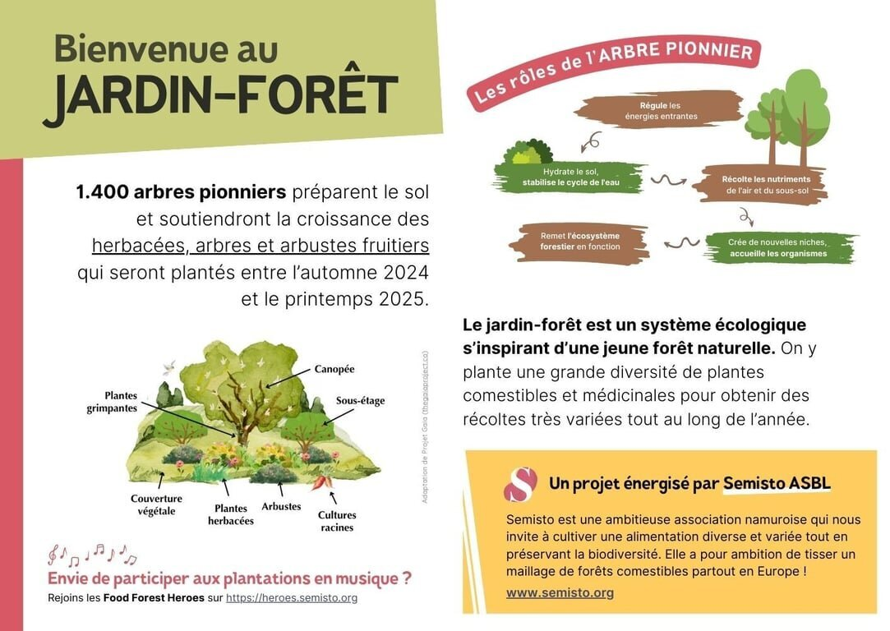
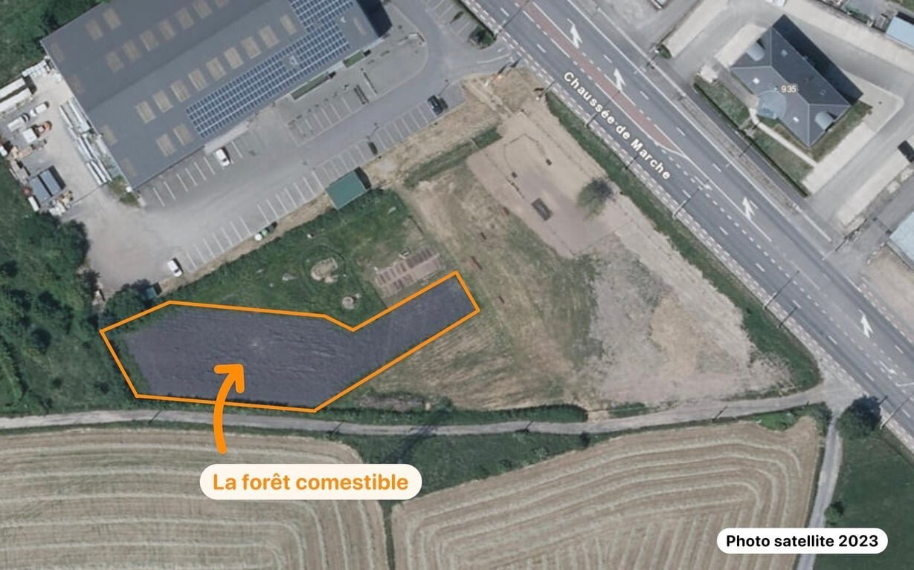

**Les Jardins d’ici, situés à Naninne, sont un lieu unique où la nature, la pédagogie et l'agroécologie se rencontrent. Ce projet rassemble plusieurs partenaires dont Semisto, Relocalise ASBL et les bénévoles de la locale Natagora “Coeur de Wallonie” autour d'une vision commune : créer un espace d'apprentissage et d'émerveillement au cœur de la biodiversité.**

Chaque partenaire prend en charge une partie des jardins, et bien entendu, Semisto t’emmène… dans le jardin-forêt !

La forêt comestible, conçue et entretenue par l'équipe de Semisto et ses partenaires, se développe progressivement sur un espace de **20 ares en bordure de Nationale 4, aux portes de Namur**.

## Découvrons la forêt nourricière
