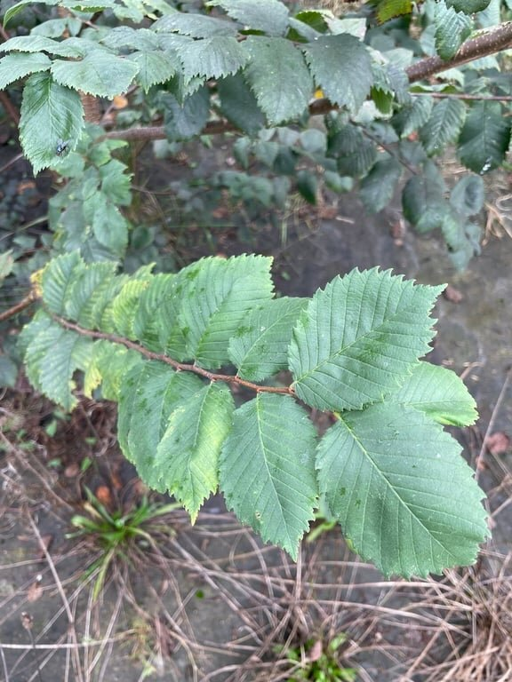
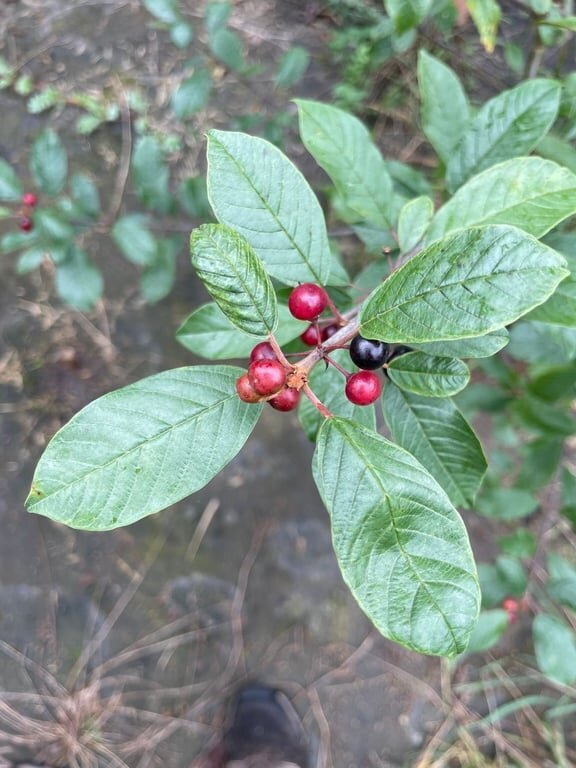
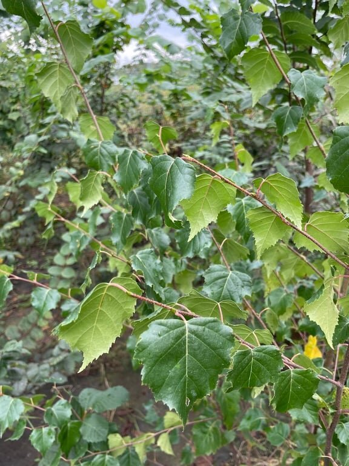
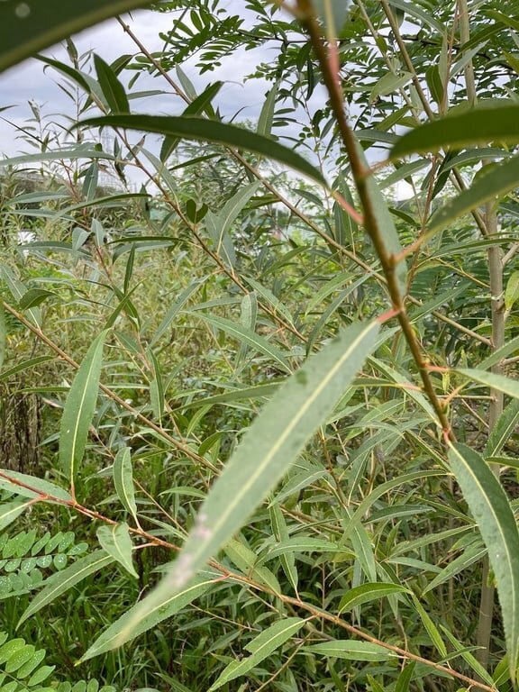
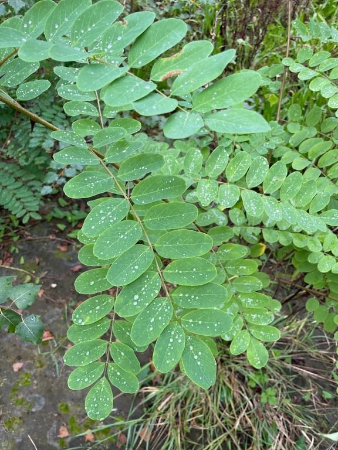
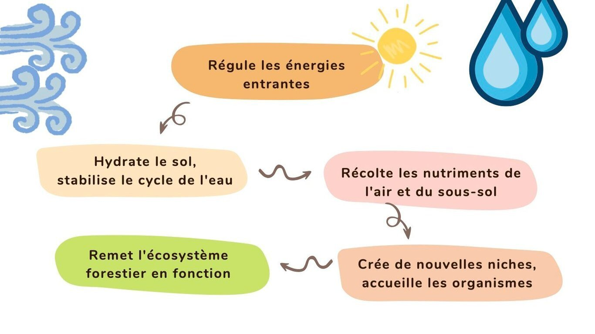
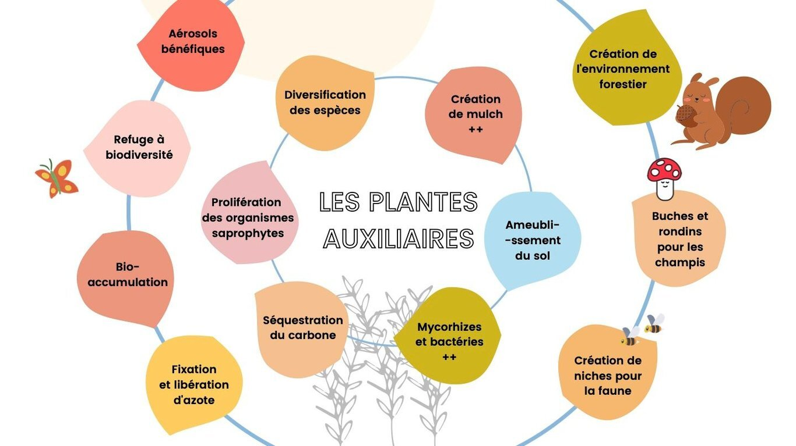

La forêt comestible en septembre 2024, avec uniquement les arbres auxiliaires

# 1.400 arbres auxiliaires

En 2023, ce ne sont pas moins de **1.400 arbres auxiliaires** qui y ont été plantés sur une bâche biodégradable pour créer un microclimat favorable au développement d'espèces productives.

Arbre auxiliaire

Nombre d’arbres plantés

Bouleau verruqueux

300

Charme

200

Noisetier

200

Bourdaine

200

Robinier faux-acacia

200

Orme lisse

150

Saule blanc

120

Saule pourpre

40

Les **espèces productives** viendront enrichir cet écosystème diversifié à partir de l’automne-hiver 2024, accessible à tous grâce à des sentiers de découverte agrémentés de panneaux explicatifs et d'étiquettes, permettant d’en apprendre davantage sur les plantes, leurs usages comestibles et médicinaux.

Si on part d'un pré ou d'un terrain nu, planter des arbres pionniers “AFI” (Architecturaux, Fertilisants, Ingénieurs) permettra de créer une canopée rapidement, au bout de quelques années. Cette étape permettra **d'éviter l'apport d'intrants** **pour recréer un sol vivant**: les arbres pionniers auront un effet positif sur le sol via l'enracinement, la création de biomasse et la décomposition des feuilles mortes. On intégrera les arbres fruitiers et strates inférieures en fonction de leurs besoins en ensoleillement.

En élaguant les arbres pionniers fixateurs d'azote, ceux-ci enrichiront le sol en carbone mais également en azote. **On élaguera à l'automne**, lorsque les précipitations prennent le dessus sur l'évaporation, afin d'apporter la lumière et l'espace nécessaire à la croissance des espèces fruitières.

On choisira ensuite de sacrifier certains AFI, en restituant le bois au sol, ce qui ouvre alors des opportunités de production pour les espèces productives de la forêt-jardin.

→ [En savoir plus sur les arbres auxiliaires, sur le Wiki de Semisto](https://www.semisto.org/articles/db/afi-arbres-auxiliaires)
