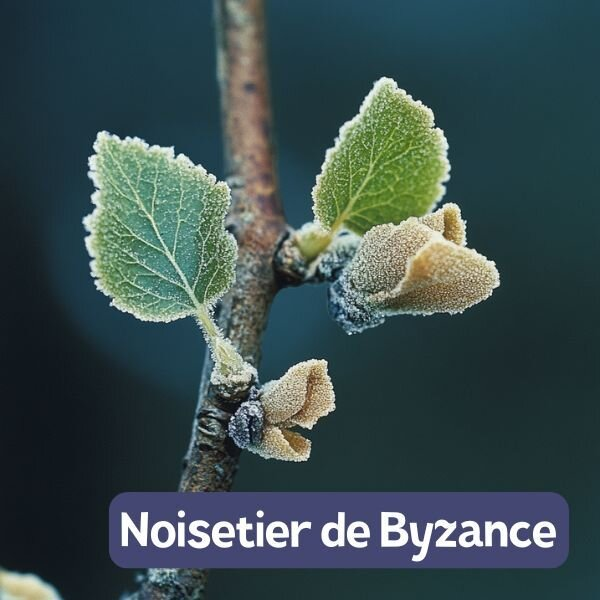
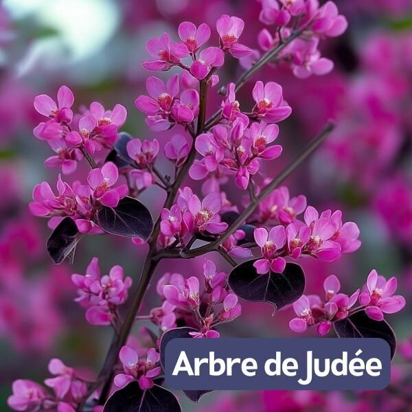
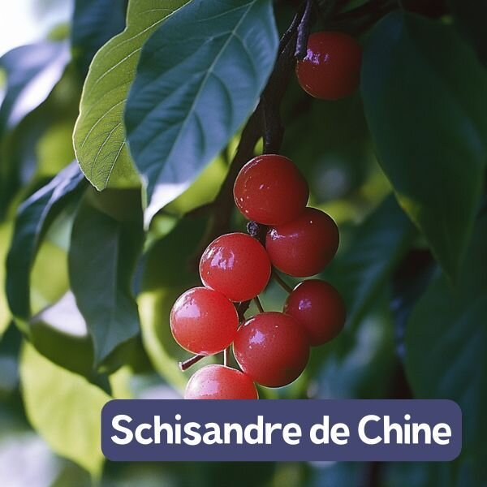
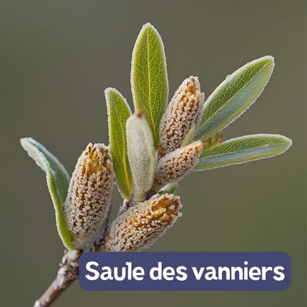
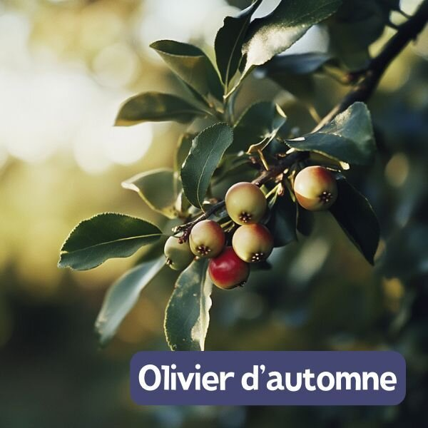
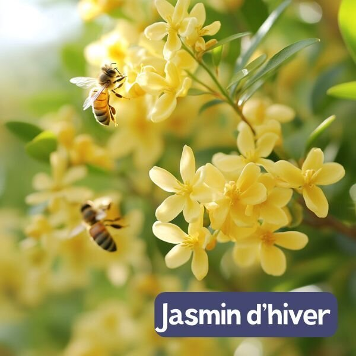

La sélection des plantes pour la forêt comestible des Jardins d’ici s'est faite avec soin, en commençant par une observation attentive des caractéristiques spécifiques du terrain. À l'Est, la gestion des sols gorgés d'eau en hiver nous a orientés vers des plantes adaptées à ces conditions, tandis qu'à l'Ouest, nous avons choisi des espèces tolérant les sols légèrement calcaires. **Cette approche nous permet de créer une vitrine attrayante et diversifiée de ce que peut offrir un jardin-forêt.**

Dans l'attente des résultats définitifs des analyses du sol, où une possible contamination au plomb est envisagée, nous avons pris la décision de ne pas cultiver de légumes-feuilles ni de légumes-racines, pour assurer la sécurité alimentaire. Nous avons donc concentré notre attention sur les strates plus hautes, privilégiant des plantes offrant des **fruits comestibles**, du **bois pour des activités artisanales** comme la vannerie, ou des **floraisons remarquables** qui enrichiront la biodiversité visuelle.

## Les fruitiers

En ce qui concerne les fruitiers, nous avons opté pour une majorité d'espèces connues, comme le prunier, tout en introduisant quelques variétés plus rares mais prometteuses, telles que le nashi. Dans tous les cas, nous avons mis l'accent sur des variétés autofertiles pour faciliter leur culture.

## Espèces mellifères

Nous n'avons pas non plus oublié les espèces mellifères, indispensables pour assurer la pollinisation tout au long de l'année. Le **jasmin d’hiver**, par exemple, apportera une contribution bienvenue avant le printemps.

## Petits buissons

Enfin, pour les buissons et plantes de moindre hauteur, nous avons sélectionné des espèces tolérant l'ombre que créeront les arbres plus grands en grandissant, comme la **schisandre de Chine** ou le **noisetier**.

## Les floraisons remarquables

Parmi les floraisons remarquables, vous pourrez admirer la **Mauve en arbre** ou encore l’**Arbre de Judée**, qui ajouteront de la couleur et attireront les pollinisateurs.

## Strate basse

Pour la strate basse, les résultats des analyses guideront nos choix vers des plantes de phytoépuration ou d'autres espèces comestibles. En attendant, nous avons veillé à ne pas surcharger l'espace, en réservant des zones pour des plantes compagnes. Ces dernières joueront un rôle clé en offrant des **services écosystémiques** essentiels : fertilisation par la fixation d’azote, mise à disposition de minéraux (avec des plantes comme le caraganier de Sibérie, l'indigotier ou le sureau), pompage de l'eau des sols (ex : aulne, saule), décompaction des sols (ex : sorbier des oiseleurs, bouleau) et création de haies brise-vent avec des espèces persistantes comme les chalefs.

💁

Découvre la **palette végétale** complète ci-dessous, une ressource précieuse qui nous servira de guide pour aménager les différentes zones de notre forêt-jardin.

## Canopée

- Aulne blanc
- [Bouleau pubescent](https://wiki.semisto.org/db/betula-pubescens)
- [Noisetier de Byzance](https://wiki.semisto.org/db/corylus-colurna)
- [Févier d'Amérique](https://wiki.semisto.org/db/gleditsia-triacanthos)
- [Noyer commun](https://wiki.semisto.org/db/juglans-regia)
- [Pacanier de l'Illinois](https://wiki.semisto.org/db/especes/carya-illinoinensis) (et variétés nordiques)

## Arbres

- [Arbre de Judée](https://wiki.semisto.org/db/cercis-siliquastrum)
- [Pommiers](https://wiki.semisto.org/db/malus-domestica)
- Mirabellier
- [Myrobolan](https://wiki.semisto.org/db/especes/prunus-cerasifera)
- [Cerisiers](https://wiki.semisto.org/db/prunus-avium)
- [Pruniers](https://wiki.semisto.org/db/prunus-domestica)
- [Nashis](https://wiki.semisto.org/db/pyrus-pyrifolia)
- [Poiriers](https://wiki.semisto.org/db/pyrus-communis)
- [Sorbier des oiseleurs](https://wiki.semisto.org/db/sorbus-aucuparia)
- [Cormier](https://wiki.semisto.org/db/sorbus-domestica)

## Grimpantes

- [Ronce fruitière](https://wiki.semisto.org/db/rubus-fruticosus)
- [Schisandre de Chine](https://wiki.semisto.org/db/especes/schisandra-chinensis)
- [Akébie](https://wiki.semisto.org/db/akebia-trifoliata)
- [Kiwi](https://wiki.semisto.org/db/actinidia-chinensis)

## Oseraie

- [Saules des vanniers](https://wiki.semisto.org/db/especes/salix-viminalis)
- [Saule blanc](https://wiki.semisto.org/db/especes/salix-alba)
- [Saule pourpre](https://wiki.semisto.org/db/especes/salix-purpurea)
- [Saule à trois étamines](https://wiki.semisto.org/db/especes/salix-triandra)

## Arbustes

- [Amélanchier à feuilles d'aulne](https://wiki.semisto.org/db/amelanchier-alnifolia)
- [Caraganier de Sibérie](https://wiki.semisto.org/db/caragana-arborescens)
- [Cognassiers asiatiques](https://wiki.semisto.org/db/chaenomeles-japonica)
- [Cornouiller mâle](https://wiki.semisto.org/db/cornus-mas)
- [Cornouiller sanguin](https://wiki.semisto.org/db/cornus-sanguinea)
- Vesce arbustive
- [Noisetier commun](https://wiki.semisto.org/db/corylus-avellana)
- Cognassier
- Chalef panaché
- Chalef de Ebbing
- [Goumi du Japon](https://wiki.semisto.org/db/elaeagnus-multiflora)
- [Olivier d'automne](https://wiki.semisto.org/db/elaeagnus-umbellata)
- [Mauve en arbre](https://wiki.semisto.org/db/hibiscus-syriacus)

- [Jasmin d'hiver](https://wiki.semisto.org/db/jasminum-nudiflorum)
- [Néflier d'Allemagne](https://wiki.semisto.org/db/mespilus-germanica)
- [Groseillier à maquereau](https://wiki.semisto.org/db/ribes-uva-crispa)
- [Casseille](https://wiki.semisto.org/db/ribes-nidigrolaria)
- [Cassissier](https://wiki.semisto.org/db/ribes-nigrum)
- [Groseillier à grappes](https://wiki.semisto.org/db/ribes-rubrum)
- [Framboise noire](https://wiki.semisto.org/db/rubus-occidentalis)
- [Framboisiers](https://wiki.semisto.org/db/rubus-idaeus)
- [Sureau noir](https://wiki.semisto.org/db/sambucus-nigra)
- [Viorne orbier](https://wiki.semisto.org/db/viburnum-opulus)
- [Argousier](https://wiki.semisto.org/db/hippophae-rhamnoides)
- Indigotier rose

Le jardin-forêt comprendra également une 🏝️ **strate aquatique comestible** pour les plans d’eau.
