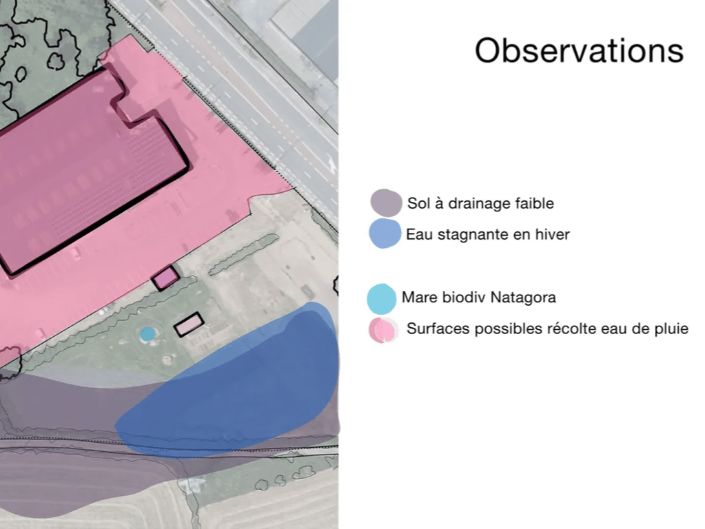
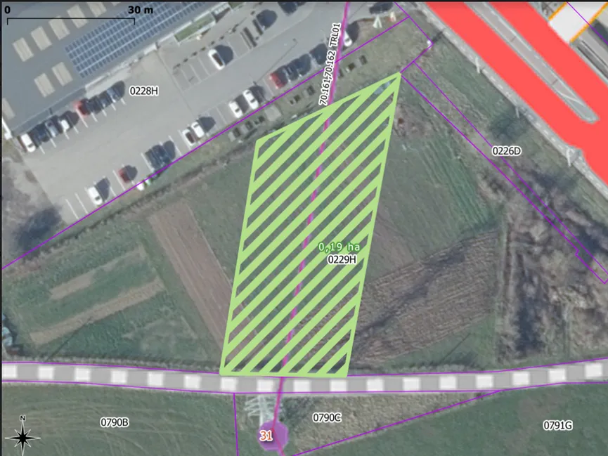
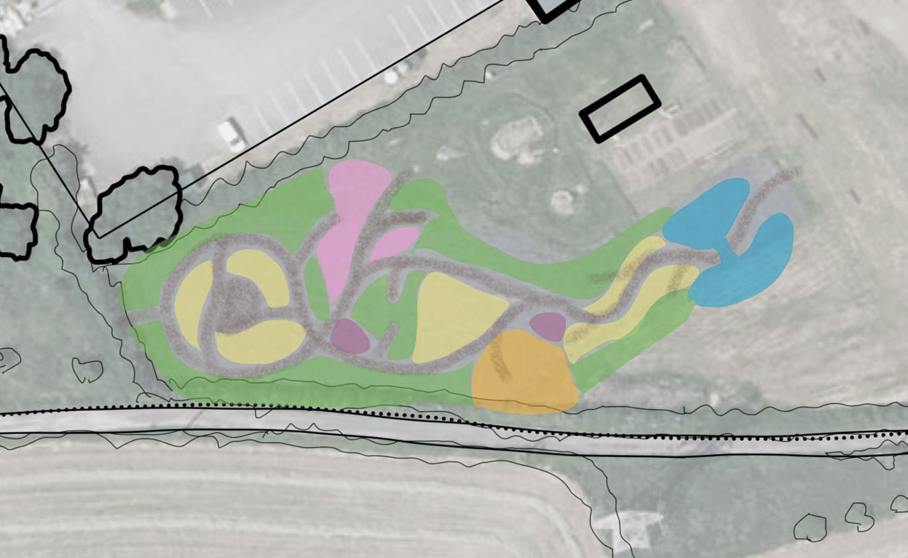
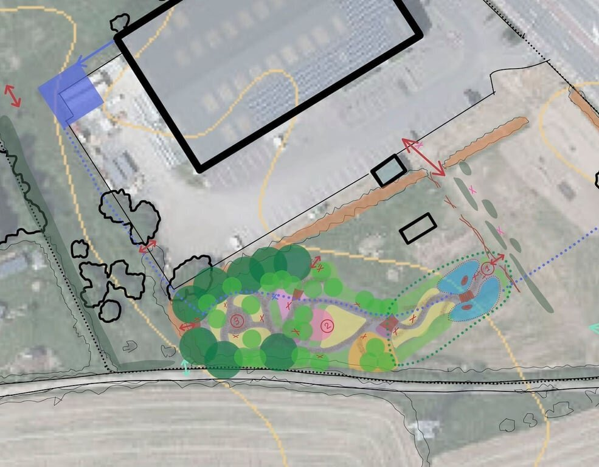
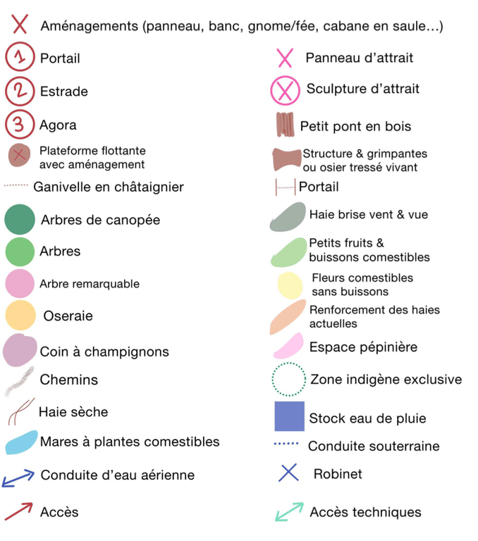

Observation des zones d’eau stagnante (en bleu foncé) et des surfaces de récolte d’eau potentielles

Observation de la zone impactée par la ligne électrique à haute tension, sous laquelle seuls des arbres indigènes pourront être plantés

Ci-dessus, le concept de cheminement. On appelle ce type de design un ***“jardin-forêt romantique”*** au sein duquel il est très agréable de se perdre. Une place à l’Ouest, “Agora” du jardin-forêt, permettra de **réunir une vingtaine de personnes**.

La **canopée** se retrouvera majoritairement côté nord, avec de grandes ouvertures dans l’ensemble du jardin-forêt afin d’assurer le passage du soleil jusqu’aux buissons les plus bas et aux herbacées.

La **zone humide** accueillera une importante faune et flore aquatique grâce à **deux grandes mares** qui viendront agrandir le réseau naturel déjà créé par la mare de biodiversité existante.

# Les contraintes

## Pas d’accès à l’eau de pluie

Le potentiel est énorme avec les toitures du bâtiment du magasin. Une récolte de ces eaux et leur stockage serait bien entendu bienvenue pour pouvoir assurer l’arrosage des jeunes plants pendant la première année. Toutefois, les arbres auxiliaires créent déjà un microclimat qui réduira les besoins en eau des jeunes plants productifs du jardin-forêt.

→ Nous souhaitons déployer une solution en terme de gestion de l’eau qui permettra également l’arrosage du potager et le remplissage des abreuvoirs des moutons.

## Pollution des sols

Une première analyse de sol nous a permis de relever des niveaux élevés de plomb, zinc et fer. Nous allons réaliser une nouvelle analyse plus précise fin 2024.

→ C’est pourquoi nous envisageons une strate de plantes herbacées non comestibles, dont certaines espèces qui joueront un rôle de phytoépuration.

## Forte exposition aux vents

Les arbres auxiliaires jouent ce premier rôle : protéger les plants du jardin-forêt des vents trop froids ou trop chauds. Car ce sont ces vents qui assèchent les plantes et augmentent le besoin en eau.

→ Notre ambition avec ce microclimat créé par la petite canopée est aussi de limiter l’impact des gels tardifs, qui peuvent réduire à néant les récoltes de fruits.

## Sol compacté, peu drainant

Les plantes bio-indicatrices nous le signalent : le sol argileux du terrain garde les stigmates de ses usages passés de pâture pour chevaux.

→ Nous prévoirons d’autres plantes compagnes pour décompacter le sol, un rôle également pris en charge par nos précieux arbres auxiliaires.
