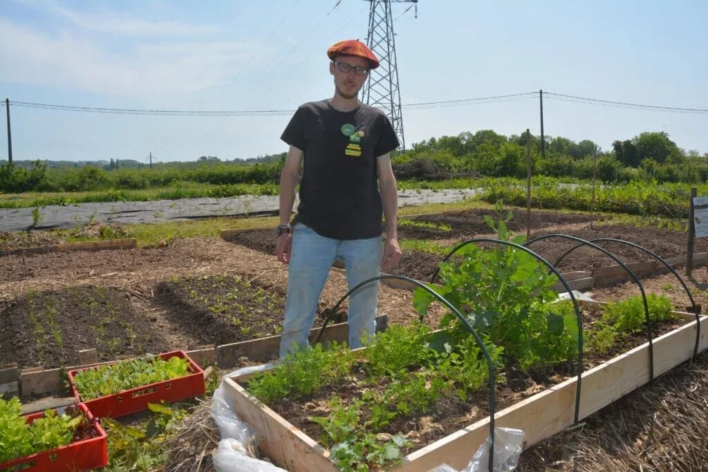

**Potagiste passionné depuis l'enfance, Simon a tout de suite accepté lorsqu’on lui a proposé de créer un jardin potager dans les Jardins d'ici.**

Simon suivait à l'époque une formation de conseiller en nutrition humaine aujourd’hui terminée avec succès. Son idée : reconnecter ce que l'on mange à ce que l'on cultive, et inversement !

Le jardin potager se veut avant tout ludique et didactique. Pas question ici de grosses productions ou d'espèces exotiques.  C'est aussi un superbe outil pour créer du lien entre les producteurs du magasin et les clients par la démonstration de leur travail au quotidien et leur dévouement !

Au gré des saisons, vous retrouverez les légumes produits dans les Jardins d'ici en magasin (toujours avec des stocks très limité au vu de la surface). Avec le temps, ce projet débuté en 2023 à vu s'ériger une serre et de de nouveaux visages. En effet, Simon reçoit parfois un peu d'aide de la part de ses collègues : un super moyen de passer du temps ensemble en prenant un bon bol d'air et surtout beaucoup de plaisir !

Afin d'approfondir ses connaissances, Simon a également suivi une formation de jardinier-maraicher en permaculture à la Ferme du Bec Hellouin (en Normandie). Ce lieu atypique lui a permis d'en apprendre plus sur la culture maraichère, les légumes de nos régions, mais surtout sur la permaculture, un mode de pensée qui nous permet de voir sous un nouvel angle le potager et tous les autres aspects de notre façon d'habiter la terre !
