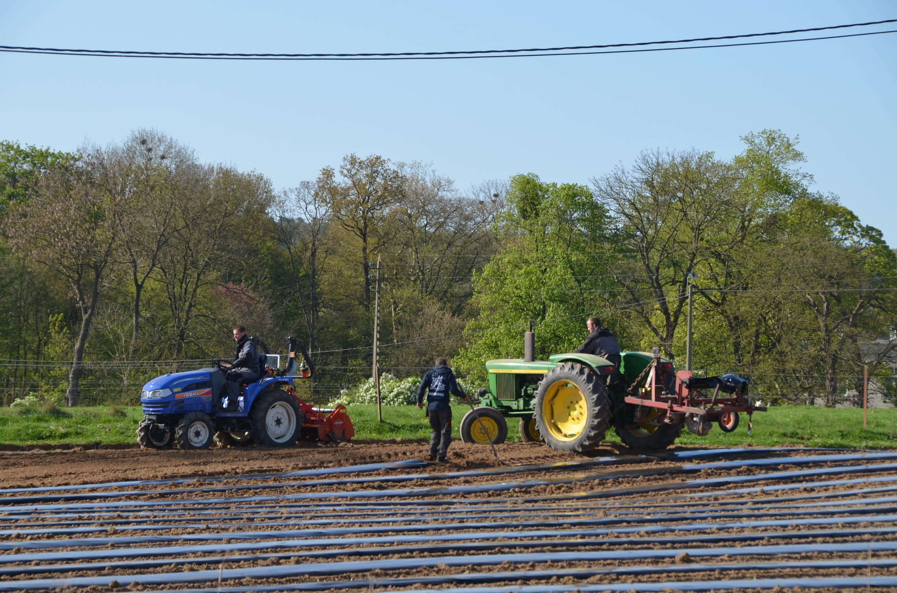
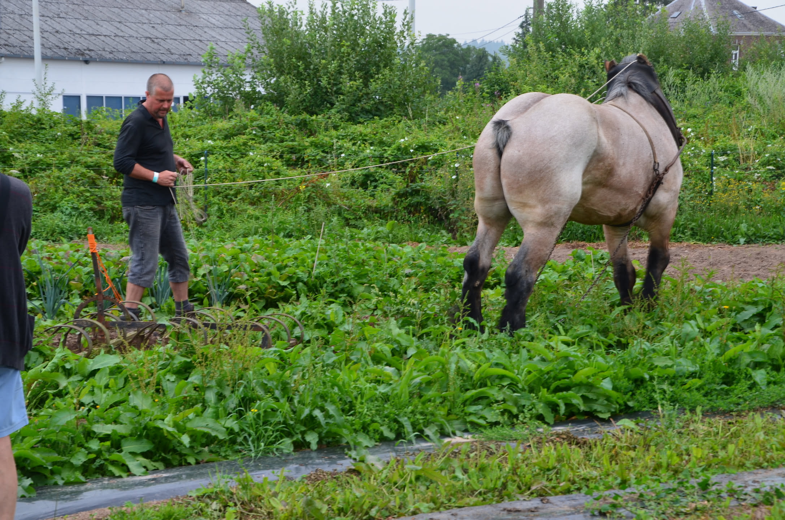
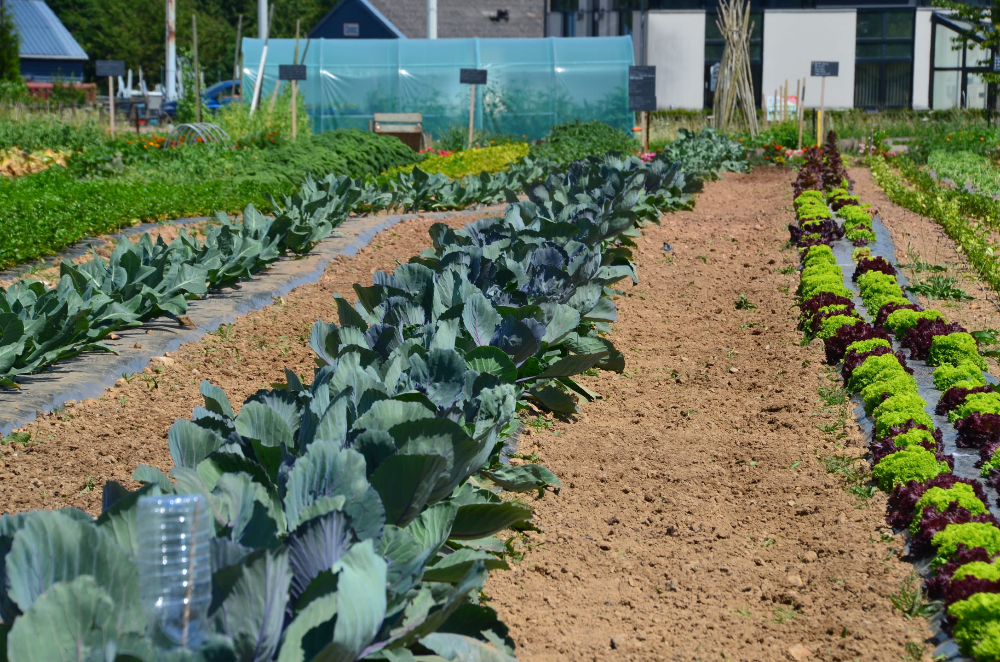
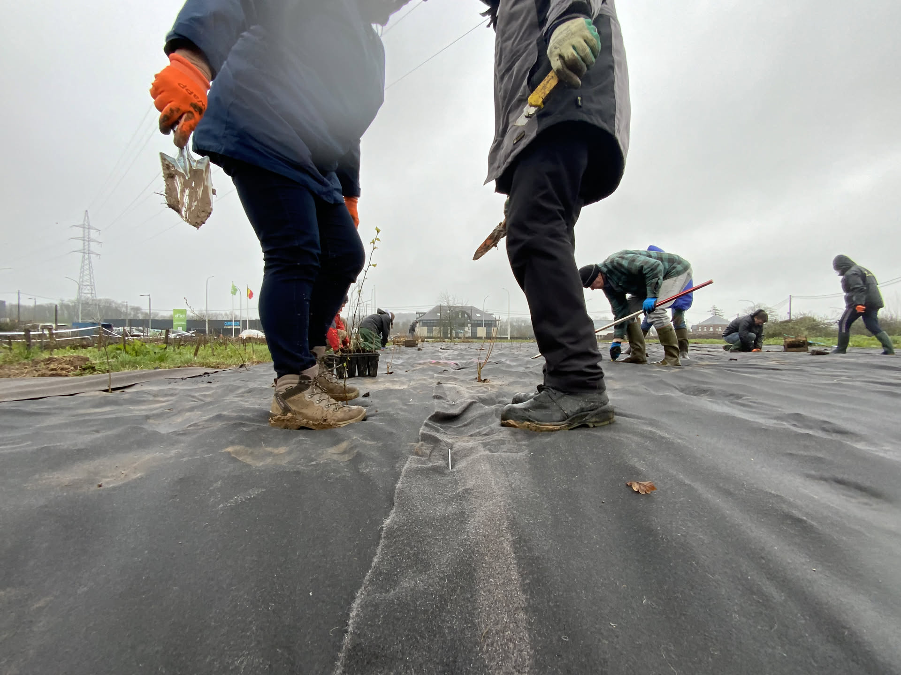
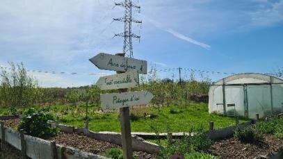
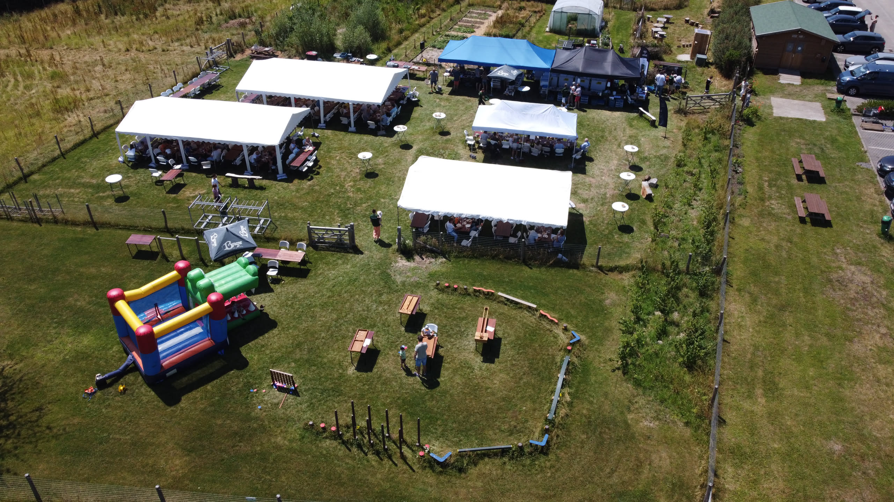

Le projet des Jardins d’ici n’est pas né d'un plan marketing bien précis, c'est une aventure humaine qui a poussé au fil des ans, des essais, des inondations et des rencontres.

## Ligne du temps des Jardins d’ici

**Mai 2013** — Ouverture du magasin *d’ici* à Naninne.

**Printemps 2014** — Premiers pas agronomiques. On accueille un premier maraîcher avec un deal simple : un terrain et une serre mis à disposition gratuitement, l'engagement d'acheter sa production à prix de marché, et l'idée d'avoir une belle vitrine pour le magasin. Bilan : un super aménagement, mais une collaboration qui s'arrête après un an.

**2014 – 2021** — Une valse de maraîchers en solo ou en équipe. Des hauts, des bas, et puis le coup de massue de 2021 et ses inondations historiques qui ravagent tout le travail accompli. Alors qu’on s’apprête à repartir, le maraîcher de l’époque tombe malade.

**Printemps 2023** — Semisto et ses bénévoles plantent les arbres pionniers de la future forêt nourricière.

**Aujourd'hui** — Le site est un véritable puzzle vivant où chacun trouve sa place, coordonné à l'origine par Frank et repris aujourd'hui côté *d’ici* par Simon. Un espace en perpétuelle évolution, qui cherche sans cesse à affiner sa vision globale et son modèle pour devenir le plus bel ambassadeur de la transition.

**2026** — Dossier pour l'appel à projets de la Ville de Namur.
