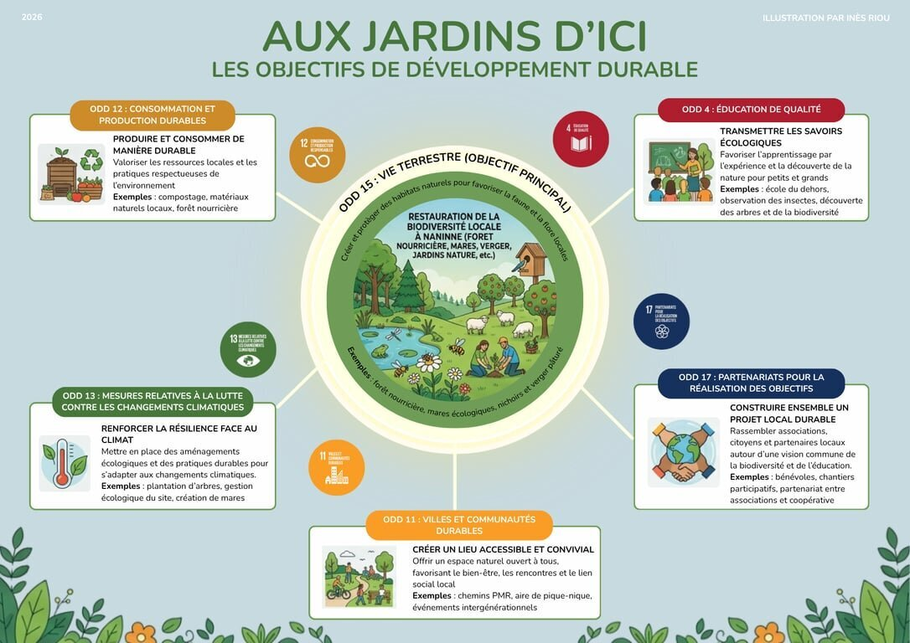

Les objectifs de développement durable (ODD), définis par les Nations Unies, constituent un appel mondial à agir pour relever les grands défis de notre planète d’ici 2030. Pour en savoir plus sur ces ambitions, vous pouvez consulter le site officiel des ODD de l’**ONU** ([Développement durable ONU](https://www.un.org/sustainabledevelopment/fr/)).

Aux Jardins d’ici, on est convaincus que la transition écologique ne se joue pas seulement à des grand sommets internationaux, mais aussi dans la terre, à notre échelle.

### **Notre projet fait écho à plusieurs de ces grands objectifs mondiaux :**

#### **ODD 15 : vie terrestre**

Notre action : Créer et protéger des habitats naturels pour favoriser la faune et la flore locales. C'est le cœur de notre partenariat avec Natagora et de nos aménagements (forêt nourricière de 20 ares, mares écologiques, nichoirs, verger et parcelles laissées en libre évolution).

#### ODD 12 : Consommation et production durables

Notre action : Produire et consommer de manière responsable en valorisant les ressources locales et les pratiques respectueuses de l'environnement (compostage, matériaux naturels locaux, circuits ultra-courts avec le magasin *d’ici*).

#### **ODD 4 : éducation de qualité**

Notre action : Transmettre les savoirs écologiques en favorisant l'apprentissage par l'expérience et la découverte de la nature pour les petits et les grands (notamment via nos activités d'"école du dehors", l'observation des insectes et la sensibilisation au vivant).

#### ODD 13 : Mesures relatives à la lutte contre les changements climatiques

Notre action : Renforcer la résilience face au climat en mettant en place des aménagements écologiques (plantation de 1 400 arbres dans la forêt nourricière, gestion écologique du site, création de mares et de zones refuges) pour stocker du carbone et recréer de la fraîcheur.

#### ODD 11 : Villes et communautés durables

Notre action : créer un lieu de vie accessible et convivial, ouvert à tous, qui favorise le bien-être, les rencontres intergénérationnelles, le partage et le lien social local (tables de pique-nique, plaine de jeux, futurs aménagements d'accessibilité).

#### ODD 17 : Partenariats pour la réalisation des objectifs

Notre action : Construire ensemble un projet local et durable en rassemblant des associations (Natagora, Relocalise, Semisto), des citoyens, des bénévoles et des partenaires économiques autour d'une vision commune de la transition.
